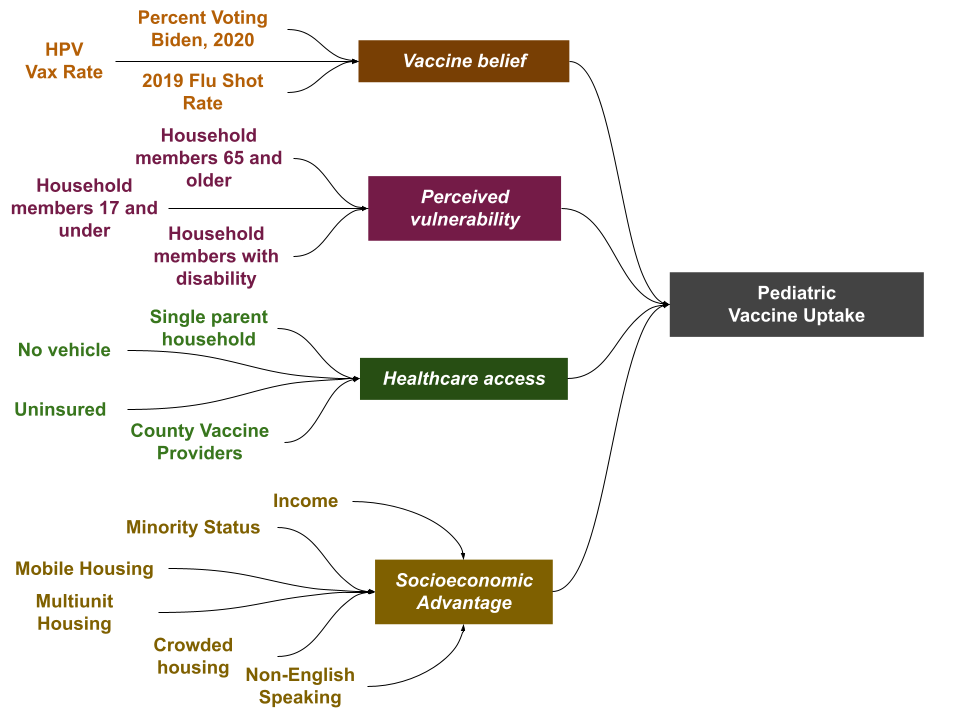

```{r setup and data, include=FALSE}
source(file = "r_scripts/01_libraries and functions.R")
source(file = "r_scripts/00_secrets.R")

county_tract_ids <- read_csv("data/county_tract_ids.csv",
  show_col_types = FALSE)

all_hazard_region <- read_csv("data/CDPHE Data/AllHazardRegions.csv",
  show_col_types = FALSE) 

selected_county <- if(
  params$county_is_region == FALSE)
  {all_hazard_region %>%
    filter(COUNTY %in% params$county) %>%
    select(COUNTY) %>%
    as.character} else 
      {all_hazard_region %>%
    filter(ALL_HAZARD_REGION %in% params$county) %>%
    select(COUNTY) %>%
    unlist()}

county_region_text_name <- case_when(
  params$county_is_region == FALSE ~ paste0(params$county," COUNTY"),
  params$county_is_region == TRUE ~ paste0(params$county, " REGION")
)

options(tigris_use_cache = TRUE)

suppressMessages({
geom_with_age <- get_acs(
  geography = "tract",
  state = "CO",
  variables = c(
    Under_18 = "B09001_001"

  ),
  year = 2017,
  geometry = TRUE
) %>%
  mutate(TractID = as.numeric(GEOID)) %>%
  mutate(Under_18 = estimate) %>%
  select(TractID, NAME,Under_18,geometry)
}
)

predictions <- read_csv("data/model predictions.csv",
  show_col_types = FALSE)

Pediatric_Vaccine_Index <- read_csv("data/Pediatric_Vaccine_Index.csv",
  show_col_types = FALSE) %>%
  left_join(county_tract_ids) %>%
  left_join(geom_with_age) %>%
  left_join(predictions)

Pediatric_Vaccine_Index_County <- Pediatric_Vaccine_Index %>%
    filter(COUNTY %in% selected_county) 


Colorado_data_mr <- read_csv("data/Colorado_data_mr.csv",
  show_col_types = FALSE) %>%
  left_join(county_tract_ids) %>%
  filter(COUNTY %in% selected_county) %>%
  left_join(geom_with_age)%>%
  left_join(predictions)

Colorado_data_mr_County <- Colorado_data_mr %>%
    filter(COUNTY %in% selected_county) 


county_data <- read_csv(
  "data/CDPHE Data/county_and_age_group_uptodate.csv",
  show_col_types = FALSE
) %>% mutate(
  COUNTY = toupper(County)
) 


```


```{r intro,echo = FALSE, results = 'asis'}
glue::glue(
  "
  **This is the pediatric COVID-19 vaccine modeling report for {county_region_text_name}.**  
  "
) %>% print

Pediatric_Vaccine_Index %>%
  mutate(selected = (COUNTY %in% selected_county)) %>%
  ggplot(aes(fill = selected,geometry = geometry,alpha=0.5)) +
  geom_sf() +
  theme_void() + 
  scale_fill_viridis(discrete = TRUE) +
  theme(legend.position = "none",
        plot.title = element_text(hjust = 0.5))+
  labs(title = glue::glue({county_region_text_name}))

```

## Introduction

The purpose of this report is to assist state and local health departments in understanding the factors which drive pediatric COVID-19 vaccination in the state of Colorado.   

A number of factors influence families’ decisions about whether or not to vaccinate their children against COVID-19. These include beliefs about the vaccine, perceived vulnerability to COVID-19, access-related factors, and socioeconomic factors. In order to increase uptake of the COVID-19 vaccine, it is important that we understand these factors and how they vary across communities.  

For example, communities which have poor access to vaccines could benefit from increased provider outreach or mobile vaccine clinics, while communities which have low vaccine beliefs may benefit more from media and community outreach.  

This report will show how specific influential factors vary by census tract and/or county across the state. This can provide information about specific neighborhoods and communities. However, this report cannot definitively say why any individual might choose to have their children vaccinated or not, and all findings should be interpreted in the context of a specific community. This report is intended to be used by both local public health departments and state-level partners. 


## Methods
This report was created using data extracted from CDPHE’s Colorado Immunization Information System (CIIS). Sociodemographic data was extracted from the CDC’s social vulnerability index. Hospital bed data was extracted from CMS: https://data.cms.gov/provider-data/. Health service area (HSA) data was extracted from SEER: https://seer.cancer.gov/seerstat/variables/countyattribs/hsa.html. Presidential election data was extracted from the upshot: https://github.com/TheUpshot/presidential-precinct-map-2020.  

The full data set was fitted to a linear model of pediatric percent vaccination. Variable selection was performed by AIC using reverse model selection. The data set was then completed via missing value imputation by chained random forests based on the full data set.  

Following variable selection, selected variables were fit into our conceptual model for vaccine adoption. Data was combined using an analogous technique used to define domains in the CDC’s social vulnerability index. We created four domains:  
- Vaccine beliefs  
- Perceived vulnerability  
- Healthcare access  
- Socioeconomic advantage  

We generated a percentile rank among all tracts in the state for each individual variable. Next, for each of the four domains we summed the percentiles for the variables comprising each theme, weighted by the variable effect in the model. We ordered the summed percentiles for each theme to determine domain-specific percentile rankings.


### Social Vulnerability Index

Our variables and methodology closely mirror the CDC's Social Vulnerability Index (SVI). The SVI was developed in 2011 in response to the *Pandemic and All-Hazards Preparedness Act of 2006* to try and quantify community vulnerability to increased morbidity, mortality from external disasters as well as a community's overall ability to respond to and be resilient from natural disaster. The SVI uses data at the census-tract level from the US Census data. It compares 15 variables that are divided into 4 key domains: socioeconomic status, household composition and disability, racial and ethnic minority status and language, and housing type and transportation. 

The goal of the SVI is to quantify a community’s risk for poor outcomes from an external stressor and therefore increase local and state entities’ ability to target communities for aid and support to decrease human suffering and economic loss. Since its initial development the CDC’s SVI has been validated in many other contexts. Importantly it has been validated in multiple health related realms including influenza vaccination rates prior to the COVID-19 pandemic. During the COVID-19 pandemic, the SVI was well correlated to other indexes in quantifying COVID cases and disparities in outcomes. The SVI has also been found to highly correlate with COVID-19 vaccination rates. 

\newpage
## Overall Pediatric Vaccination Rate


```{r highlevel,echo = FALSE, results = 'asis'}

glue::glue(
  "
  There are {nrow(Pediatric_Vaccine_Index_County)} census tracts in {county_region_text_name}. The median pediatric vaccination rate for {county_region_text_name} census tracts is {median(Pediatric_Vaccine_Index_County$PERCENT_VAX_0_17)}%, with a range of {min(Pediatric_Vaccine_Index_County$PERCENT_VAX_0_17)} to {max(Pediatric_Vaccine_Index_County$PERCENT_VAX_0_17)}. 
  
  The charts shown below illustrate the percentile rank of {county_region_text_name} pediatric vaccination compared to the state as a whole.
  "
) %>%
  print()

```


```{r fig1, echo=FALSE, results = 'asis', fig.height = 3, fig.width = 8, fig.align = "center"}
p1 <- Pediatric_Vaccine_Index_County %>%
ggplot(aes(fill = PERCENT_VAX_0_17,geometry = geometry)) +
  geom_sf()+
    theme_void() +
    scale_fill_viridis(option = "E",
      limits = c(0,100), 
      name="")+
  labs(title = "",
       subtitle = "") +
  theme(
    legend.position = "bottom"
  )

p2 <- Pediatric_Vaccine_Index %>%
  mutate(selcted = (COUNTY %in% selected_county)) %>%
  mutate(vax_pct = round(PERCENT_VAX_0_17/5,0)*5) %>%
  group_by(vax_pct,selcted) %>%
  summarize(count = n(),.groups = "drop") %>%
  ggplot(aes(x=vax_pct,y=count,fill=selcted))+
  geom_bar(position = "stack",stat="identity",alpha = 0.5)+
  geom_vline(xintercept = median(Pediatric_Vaccine_Index_County$PERCENT_VAX_0_17), color = "#fde725",linewidth = 2)+
  geom_vline(xintercept = median(Pediatric_Vaccine_Index$PERCENT_VAX_0_17), color = "#440154",linewidth = 2)+
  scale_fill_viridis(discrete = T) +
  labs(title = "",
       subtitle = "")+
  theme_fivethirtyeight()+
  ylab("Number of Census Tracts")+
  theme(axis.title.y = element_text(),
       legend.position = "none")


ggarrange(p1,p2,nrow = 1,widths = c(1,1),
          labels = "AUTO")

glue::glue(
  "
  
  *Figure A: Percent of pediatric population vaccinated against COVID-19 by census tract.*  
  
  *Figure B. Percent of pediatric population vaccinated against COVID-19 by census tract, with {county_region_text_name} tracts indicated in yellow. Vertical lines indicates the median value for both {county_region_text_name} and the state as a whole.*  

  "
) %>%
  print()

```


\newpage

  
## Factors which affect vaccination

A conceptual model was created to better understand the factors which are most influential in determining a county's pediatric vaccination rate. These factors are divided into four themes: Vaccine Beliefs, Perceived Vulnerability, Healthcare Access, and Socioeconomic Disadvantage.

The ranking of each tract and county for these themes may suggest targeted interventions. For example, a county which has low overall vaccine belief may benefit from targeted messaging, while tracts with low healthcare access may benefit from additional providers or expanded clinic hours.




```{r factor modeling,echo = FALSE, results = 'asis',fig.height = 6, fig.width = 8, fig.align = "center"}

glue::glue(
  "
 
  {county_region_text_name}'s median percentile ranking in these domains are:  
  - Vaccine beliefs: {round(100*median(Pediatric_Vaccine_Index_County$Belief_pct),0)}th percentile  
  - Perceived vulnerability: {round(100*median(Pediatric_Vaccine_Index_County$Perc_Vuln_pct),0)}th percentile  
  - Healthcare access: {round(100*median(Pediatric_Vaccine_Index_County$HC_access_pct),0)}th percentile  
  - Socioeconomic advantage: {round(100*median(Pediatric_Vaccine_Index_County$SE_Disadv_pct),0)}th percentile 
  
  A higher percentile rank in each domain predicts a higher pediatric COVID-19 vaccination rate. A percentile rank of 25% in a specific domain means that 75% of census tracts in Colorado have a higher predicted vaccination rate based on that domain. 
  
  A region with a low percentile ranking in a specific domain may choose to target interventions at that domain; for example, poor healthcare access could be addressed by adding vaccine providers or mobile vaccine clinics.
  
  The below maps reflect the distribution of these domains in {county_region_text_name}:

  "
) %>%
  print()

p6 <- Pediatric_Vaccine_Index_County %>%
  ggplot(aes(fill = 100*Belief_pct,geometry = geometry)) +
  geom_sf()+
    theme_void() +
    scale_fill_viridis(option = "B",
                       limits = c(0,100), 
      name="") +
  labs(title = "Vaccine Belief",
       subtitle = "") +
  theme(
    legend.position = "bottom"
  )

p7 <- Pediatric_Vaccine_Index_County %>%
  ggplot(aes(fill = 100*Perc_Vuln_pct,geometry = geometry)) +
  geom_sf()+
    theme_void() +
    scale_fill_viridis(option = "C",limits = c(0,100), 
      name="") +
  labs(title = "Perceived Vulnerability",
       subtitle = "") +
  theme(
    legend.position = "bottom"
  )

p8 <- Pediatric_Vaccine_Index_County %>%
  ggplot(aes(fill = 100*HC_access_pct,geometry = geometry)) +
  geom_sf()+
    theme_void() +
    scale_fill_viridis(option = "D",limits = c(0,100), 
      name=""
            ) +
  labs(title = "Healthcare Access",
       subtitle = "") +
  theme(
    legend.position = "bottom"
  )

p9 <- Pediatric_Vaccine_Index_County %>%
  ggplot(aes(fill = 100*SE_Disadv_pct,geometry = geometry)) +
  geom_sf()+
    theme_void() +
    scale_fill_viridis(option = "E",limits = c(0,100), 
      name="" ) +
  labs(title = "Socioeconomic Advantage",
       subtitle = "") +
  theme(
    legend.position = "bottom"
  )


ggarrange(p6,p7,p8,p9,nrow = 2,ncol = 2, widths = c(1,1),heights = c(1,1),
          labels = "AUTO",align = "h")

glue::glue(
  "
  Chloropleth maps showing percentile ranking for each of the four domains compared to the state as a whole. A higher ranking in each domain predicts higher pediatric vaccinaton coverage. These maps may be used to identify strengths and vulnerabilities of different regions.
    
  *Figure A: Belief in vaccine efficacy. (Note tract level data is not available for these variables.)*
  
  *Figure B: Perceived vulnerability to COVID-19.*  
  
  *Figure C: Access to healthcare and vaccination resources.*
  
  *Figure D: Socioeconomic advantage.*

  "
) %>%
  print()
```

\newpage


#### Additional Information: Model error
Modeling can capture many of the factors which influence pediatric COVID-19 vaccination rates. However, no model can comprehensively  capture all the factors which might lead to an individual choosing to vaccinate themselves or their family members. The effect of these unmeasured factors are what generates *model error*: the differences between what is predicted and what actually occurred.  

Model error can be used as a starting point to better understand the effects of unique and evolving community factors and programs. An effective community level public health effort, such as a school-based vaccine clinic, might increase pediatric vaccination rates above what would be predicted. 

On the other hand, in some cases model error might reflect limitations in the model. Population factors and vaccination rates in census tracts that are heavily industrial or are dominated by airports might be difficult to measure, let alone correlate with the vaccination choices of a small number of residents.  

Finally, it is critically important that we do not lower the bar for health equity simply because a community faces additional challenges in achieving a higher vaccination rate. CDPHE's vision of "A healthy and sustainable Colorado where current and future generations thrive" is not limited to neighborhoods or communities where optimal health is easier to achieve.  


```{r model error,echo = FALSE, results = 'asis',fig.height = 6, fig.width = 8, fig.align = "center",warning=FALSE}


glue::glue(
  "
 
  Based on modeling incorporating the SVI, political, and healthcare access factors, {county_region_text_name} has a predicted median tract vaccination rate of {round(median(Pediatric_Vaccine_Index_County$prediction,na.rm=TRUE),1)}%.

  "
) %>%
  print()

p3 <-Pediatric_Vaccine_Index_County %>%
    mutate(vax_pct = round(PERCENT_VAX_0_17/5,0)*5) %>%
    mutate(pred_vax_pct = round(prediction/5,0)*5) %>%
  ggplot() +
  geom_bar(aes(x=vax_pct),fill="#3b528b")+
   geom_bar(aes(x=pred_vax_pct),fill = "#5ec962",alpha = 0.5)+
  geom_vline(xintercept = median(Pediatric_Vaccine_Index_County$PERCENT_VAX_0_17), color = "#3b528b",linewidth = 2)+
  geom_vline(xintercept = median(Pediatric_Vaccine_Index_County$prediction), color = "#5ec962",linewidth = 2)+
    theme_fivethirtyeight()+
  theme(legend.position = "none")


p4 <- Pediatric_Vaccine_Index %>%
  mutate(selected = (COUNTY %in% selected_county)) %>%
  arrange(selected) %>%
  ggplot(aes(x=PERCENT_VAX_0_17,y=prediction))+
  geom_point(aes(color = selected, size = selected/2),alpha = 0.5)+
  geom_abline(intercept = 0, slope = 1) + 
  scale_color_viridis(discrete = TRUE)+
  xlab("Pediatric Vaccination Rate")+
  ylab("Predicted Pediatric Vaccination Rate")+
  theme_fivethirtyeight()+
  theme(legend.position = "none") +
  annotate("text", x = 25, y = 75, label = glue::glue("Higher Than 
                                                      Predicted Vaccination"), size = 3)+
  annotate("text", x = 75, y= 25, label = glue::glue("Lower Than 
                                                      Predicted Vaccination"), size = 3)


p5 <- Pediatric_Vaccine_Index_County %>%
  ggplot(aes(fill = PERCENT_VAX_0_17-prediction,geometry = geometry)) +
  geom_sf()+
    theme_void() +
    scale_fill_viridis(option = "C",
                       limits = c(-50,50), 
      name="") +
  labs(title = "",
       subtitle = "") +
  theme(
    legend.position = "bottom"
  )

ggarrange(p3,p4,p5,nrow = 2,ncol = 2, widths = c(1,1,2),heights = c(1,1,2),
          labels = "AUTO",align = "h")

glue::glue(
  "
  
  *Figure A: Predicted vaccination rates (green) and actual vaccination rates (blue) for census tracts in {county_region_text_name}. Vertical lines show median values.*  
  
  *Figure B. Predicted and actual vaccination rates by census tract in Colorado. {county_region_text_name} tracts shown in yellow, other census tracts in Colorado shown in purple. Tracts above the diagonal line are overperforming relative to predictions. Tracts below the line are underperforming.*  
  
  *Figure C. Map of difference between predicted and actual pediatric vaccination rate by census tract in {county_region_text_name}. Higher values (yellow, oranges) indicate relatively overperforming tracts; lower values (blue, purple) indicate relatively underperforming tracts.*

  "
) %>%
  print()

```

\newpage

#### Notes  

Data underlying the analysis and percentile ranking for vaccine themes can be found here:   <https://docs.google.com/spreadsheets/d/1ev11xrT6BYuvQ1qsOcxNfPFV8CtKCMOwxhgTlgoTe8s/edit?usp=sharing>

Specific questions about the analysis can be sent to:  
<brian.erly@state.co.us>  
<shannon.obrien@state.co.us>
<therese.pilonetti@state.co.us>

Analysis performed in R version 4.1.3 (2022-03-10). Document prepared in RMarkdown.

